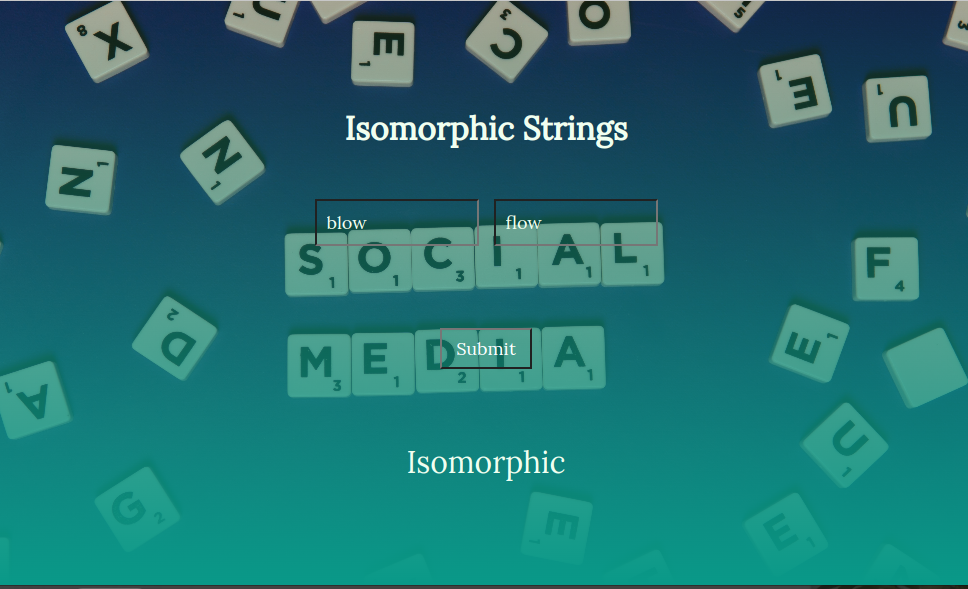

# JS Isomorphic Strings
Two ​strings​ str1 and str2 are called ​isomorphic​ if there is a one-to-one mapping possible for every character of str1 to every character of str2. Develop an app that checks ​two strings s and t, to determine if they are isomorphic. Two strings are isomorphic if the characters in s can be replaced to get t.
## App

### Built with
- HTML
- CSS
- JavaScript
### Prerequisites
Knowledge about:
- HTML
- CSS
- JavaScript
- Google Chrome
### Clone project
Get a local copy of this project by following the steps below:
- Clone this repository using `git@github.com:Nathanael-Lontsi/isomorphic.git`
- Move to the project directory by typing : cd JavaScript and cd isomorphic in your terminal.
## Steps
- $ git clone `git@github.com:Nathanael-Lontsi/isomorphic.git`
- $ `cd isomorphic`
- $ `git checkout feature/strings`
## Start up
- Run by opening index.html using the browser
: bust_in_silhouette: **Nathanael-Lontsi**
## :handshake :Contributions
We welcome contributions, issues and feature request.
Feel free to check the [issues page](https://github.com/Nathanael-Lontsi/isomorphic/issues)
## :memo :License
This project is [rebaseacademy](./LICENSE) licensed.